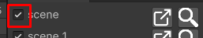
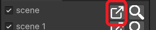
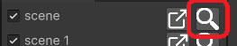

# Scene Browser

## Introduction:
This tool is useful when you have multiple scenes scattered across all the projects, as seen in the Beta Project. This tool will help you to list all the scenes in your project's build settings. You can open and select the scenes directly from the window. Not just that you can also toggle the scenes on and off in the build settings right from this window.

With this tool, my goal is to create a small form where you can navigate to your scenes. I want to keep this thing minimal. I don't want to clutter this with any other options related to build settings or anything else. With that being said I will be happy to take any feedback and suggestion you may have. Speaking of feedback I suck at good-looking UI feel free if you want to tweak the UI to your liking and raise a PR.

## How To Use:
 - To use this tool import import this package, after installation look for the "Tools" menu, in which you will see a menu item named "Scene Browser". Use that to open the tool window.
 - In the window, you will get the list of all the scenes added to your build settings. This list is updated with the list of build settings list.
 - Visual breakdown
    - In the list, you will see a checkbox representing the status of the scene in the build settings.
    
    - Then there is the name of the scene.

    - Then there are two buttons that are used to "Open the scene"  and to "Select the scene"  in the project window.

## How to contribute?
I don't have anything written in stone so to speak. I am new to this Open Source Software thing. I am not even sure what kind of rules should be there and TBH I am not as big of a fan of bureaucracy. Just keep in mind to not push your code directly and to create a PR instead. While creating the PR make sure that you take a back-merge(where your branch is up to date with the branch from where your branch originated plus all of your commits). Just for me to make sure that there will be no conflicts if I decide to approve and merge the PR.
